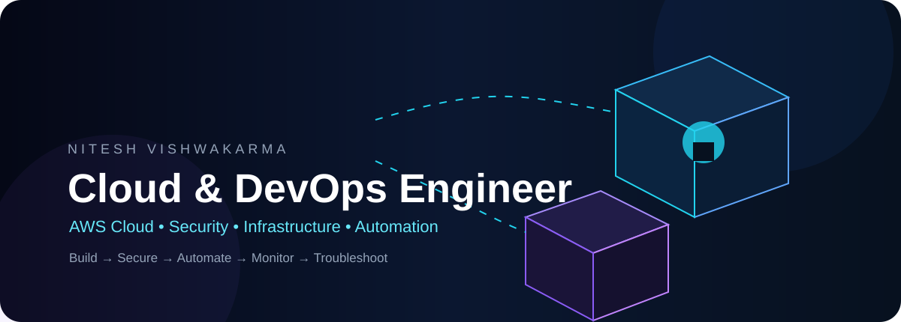

  

---

## 👩‍💻 About Me

I'm a **1st-semester BCA student** beginning my journey in **Cloud Computing, IT Infrastructure, AWS, and Computer Networking**.

I'm currently building a strong technical foundation through **AWS fundamentals, networking, Linux, Python, SQL, and cloud security concepts**, while gaining practical experience through small hands-on projects and technical labs.

- ☁️ Learning AWS cloud computing fundamentals
- 🌐 Building foundations in computer networking
- 🔐 Exploring cloud security fundamentals
- 🖥️ Learning Linux and Windows system fundamentals
- 🐍 Developing Python and SQL skills
- 🗄️ Built and deployed a personal portfolio website using Amazon S3
- 🔧 Practicing Git, GitHub and Cisco Packet Tracer
- 🎓 1st-semester Bachelor of Computer Applications (BCA) student
- 🚀 Building a foundation for a future career in Cloud Engineering and Cloud Security

---

## ⚡ Current Learning Focus

| Area | Focus |
|---|---|
| ☁️ Cloud | AWS, EC2, VPC, S3, RDS, IAM, CloudWatch |
| 🌐 Networking | TCP/IP, OSI Model, IPv4, Subnetting, DNS, DHCP, NAT, Routing |
| 🔐 Security | IAM, Security Groups, Network Segmentation, Access Control |
| 🖥️ Systems | Linux, Windows, File & Process Management |
| 🐍 Programming | Python, SQL |
| 🛠️ Tools | Git, GitHub, Cisco Packet Tracer |
| 📊 Operations | Basic Troubleshooting and Monitoring |
| ☁️ Deployment | Amazon S3 Static Website Hosting |

---

## 🧰 Technology Stack

### ☁️ Cloud & AWS

**AWS:** EC2 • VPC • IAM • S3 • RDS • CloudWatch

**Cloud:** Cloud Computing Fundamentals • AWS Fundamentals • Cloud Infrastructure Fundamentals

### 🌐 Networking

**Networking:** TCP/IP • OSI Model • IPv4 • Subnetting • DNS • DHCP • NAT • Routing • HTTP/HTTPS

**Practical Tools:** Cisco Packet Tracer • Network Troubleshooting

### 🖥️ Systems

**Systems:** Linux Fundamentals • Windows • File Management • Process Management • System Troubleshooting

### 🐍 Programming & Database

**Programming:** Python

**Database:** SQL

### 🔧 Tools & Platforms

**Tools:** Git • GitHub • Cisco Packet Tracer

---

# 🏗️ Featured Project

## ☁️ Personal Portfolio Website — AWS S3 Deployment

A beginner-friendly cloud project focused on learning **Amazon S3, static website hosting, cloud storage, and basic AWS deployment**.

### Architecture Flow

    Internet
       │
       ▼
    ┌─────────────────┐
    │    Amazon S3    │
    │ Static Website  │
    │    Hosting      │
    └────────┬────────┘
             │
             ▼
    ┌─────────────────┐
    │ HTML / CSS / JS │
    │ Portfolio Site  │
    └─────────────────┘

### What I Built

- Designed and developed a responsive personal portfolio website
- Used HTML, CSS and JavaScript
- Created an Amazon S3 bucket for website deployment
- Configured S3 static website hosting
- Uploaded and managed website files through Amazon S3
- Configured the required web-access settings
- Verified the live application through the public hosting endpoint
- Practiced AWS storage and basic cloud deployment workflows
- Gained practical exposure to cloud-based website hosting

### Technologies

`HTML` • `CSS` • `JavaScript` • `Amazon S3` • `AWS Cloud`

---

# 🔐 Cloud Security Learning

I'm currently exploring the fundamentals of **cloud security and secure infrastructure**.

### Security Areas

- IAM fundamentals
- IAM policies and permissions
- Authentication and authorization
- Security Groups
- Network segmentation
- Public vs private network concepts
- Access control
- Cloud logging fundamentals
- AWS CloudWatch
- Secure cloud configuration
- Basic cloud security principles

---

# 🌐 Computer Networking Learning

Computer networking is one of the key foundations I'm developing for my future cloud career.

### Core Concepts

**TCP/IP** • **OSI Model** • **IPv4** • **Subnetting** • **Routing** • **DNS** • **DHCP** • **NAT** • **HTTP/HTTPS** • **Network Troubleshooting**

### Practical Learning

- Cisco Packet Tracer
- IP addressing
- Subnetting
- Routing fundamentals
- Basic network configuration
- Network troubleshooting
- Understanding application communication
- Understanding how networking supports cloud infrastructure

---

# ☁️ AWS Learning Journey

Currently learning the fundamentals of:

    AWS
     │
     ├── EC2
     ├── VPC
     ├── IAM
     ├── S3
     ├── RDS
     └── CloudWatch

My current goal is to understand **what each AWS service does, why it is used, and how different services work together** to support cloud applications.

---

# 🧠 Learning Approach

**LEARN → PRACTICE → BUILD → TEST → TROUBLESHOOT → IMPROVE**

As a first-semester student, I'm focusing on understanding the fundamentals before moving toward advanced cloud technologies.

My current learning path:

**Computer Fundamentals → Networking → Linux & Systems → AWS Fundamentals → Cloud Security → Practical Projects**

---

# 📚 Currently Learning

- AWS cloud computing fundamentals
- AWS EC2 fundamentals
- AWS VPC and basic networking
- IAM and access control
- Amazon S3
- RDS database fundamentals
- CloudWatch monitoring fundamentals
- Linux fundamentals
- Python fundamentals
- SQL fundamentals
- Computer networking
- Cisco Packet Tracer
- Git and GitHub
- Basic cloud security concepts
- Secure cloud deployment fundamentals

---

# 🎓 Education

**Bachelor of Computer Applications (BCA)**

Amity University Online

**2026 – 2029**

**Current Status:** 1st Semester

### Academic & Learning Focus

- IT Infrastructure
- Computer Networking
- AWS Cloud Computing
- Linux Systems
- Python
- SQL
- Cloud Security Fundamentals

---

# 🎯 Career Direction

**Cloud Engineering • AWS Cloud • Cloud Support • Cloud Infrastructure • Cloud Operations • Cloud Security • IT Infrastructure**

My long-term goal is to build strong fundamentals in **cloud infrastructure, networking, and security**, gain practical experience through projects, and gradually grow toward professional roles in **Cloud Engineering and Cloud Security**.

---

# 🤝 Connect With Me

<a href="YOUR_LINKEDIN_URL">LinkedIn</a> •
<a href="YOUR_PORTFOLIO_URL">Portfolio</a> •
<a href="mailto:alka630@gmail.com">Email</a>

### ☁️ Learn • 🌐 Connect • 🔐 Secure • 🛠️ Build • 🚀 Grow

